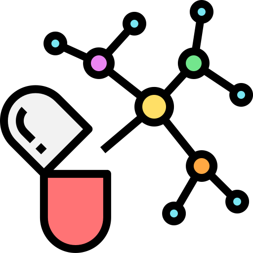

# DrugCheck - Medication Interaction Analyzer



DrugCheck is a modern web application that helps users identify potential drug interactions and provides comprehensive medication analysis with AI-powered insights.

## 🌟 Features

- **Smart Drug Search**: Quickly search and find medications from our comprehensive database
- **Interaction Detection**: Advanced AI-powered detection of potential drug interactions
- **Safety First**: Get detailed safety information and recommendations
- **Professional Insights**: Based on trusted medical databases and research
- **Search History**: Keep track of your previous medication searches and interactions
- **Real-Time Updates**: Access the latest drug information with automatic database updates
- **PDF Reports**: Download comprehensive medication analysis reports in PDF format

## 🚀 Getting Started

### Prerequisites

- Node.js (v18 or higher)
- npm or yarn

### Installation

1. Clone the repository:
   ```bash
   git clone https://github.com/yourusername/drug-check.git
   cd drug-check
   ```

2. Install dependencies:
   ```bash
   npm install
   # or
   yarn
   ```

3. Create a `.env` file based on `.env.example` and add your API keys:
   ```
   VITE_MISTRAL_API_KEY=your_mistral_api_key_here
   VITE_MEDICAL_MODEL=mistral-medium
   ```

4. Start the development server:
   ```bash
   npm run dev
   # or
   yarn dev
   ```

5. Open your browser and navigate to `http://localhost:5173`

## 🛠️ Built With

- [React](https://reactjs.org/) - UI library
- [TypeScript](https://www.typescriptlang.org/) - Type safety
- [Vite](https://vitejs.dev/) - Build tool
- [Framer Motion](https://www.framer.com/motion/) - Animations
- [React Router](https://reactrouter.com/) - Routing
- [React Icons](https://react-icons.github.io/react-icons/) - Icon library
- [jsPDF](https://github.com/parallax/jsPDF) - PDF generation
- [Mistral AI](https://mistral.ai/) - AI-powered analysis

## 📋 API Usage

DrugCheck uses the following APIs:

- **RxNorm API**: For medication data and basic interaction information
- **Mistral AI API**: For enhanced interaction analysis and comprehensive reports

## 🧪 Running Tests

```bash
npm run test
```


## 🚢 Deployment

Build the application for production:

```bash
npm run build
```


The build artifacts will be stored in the `dist/` directory.

## 📝 License

This project is licensed under the MIT License - see the [LICENSE](LICENSE) file for details.

## ⚠️ Disclaimer

DrugCheck is for informational purposes only and does not replace professional medical advice. Always consult with your healthcare provider before making any changes to your medication regimen.

## 🤝 Contributing

Contributions are welcome! Please feel free to submit a Pull Request.

1. Fork the repository
2. Create your feature branch (`git checkout -b feature/amazing-feature`)
3. Commit your changes (`git commit -m 'Add some amazing feature'`)
4. Push to the branch (`git push origin feature/amazing-feature`)
5. Open a Pull Request

## 📬 Contact

For any questions or support, please reach out to:

Email: cb2117@srmist.edu.in
Email: ss5429@srmist.edu.in


## 🙏 Acknowledgements

- [National Library of Medicine](https://www.nlm.nih.gov/) - For the RxNorm API
- [Mistral AI](https://mistral.ai/) - For AI capabilities


